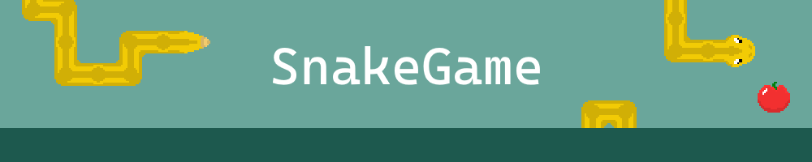

## ⭐️ About

SnakeGame is an implementation made with JavaScript, TypeScript, and React of a famous classic game called Snake.

## 🕹️ Play Online

[Snake Game Online](https://snake.davilhlapak.com.br/)

## 🚀 Getting Started

Clone this repository and install the dependencies using your preferred package manager.

```bash
pnpm install
# or
yarn
# or
npm install
```

## 🧩 How to play

-   The objective is to eat all the fruits on the screen using the snake's head.
-   To control your snake, you can press any of the arrow keys ⬅️⬆️➡️⬇️ on your keyboard or swipe the screen 👇 in the mobile version.
